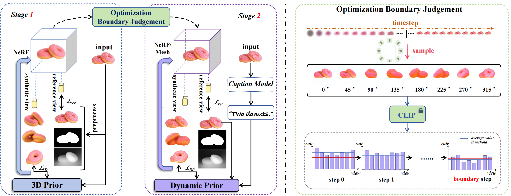

######
<p align="center">

  <h2 align="center">Consistent123: One Image to Highly Consistent 3D Asset Using Case-Aware Diffusion Priors </h2>

######
<p align="center">
<!-- [paper](https://arxiv.org/abs/2309.17261) | [project page](https://consistent123.github.io/) -->
 <!-- </br> -->
        <a href="https://arxiv.org/abs/2309.17261"></a> &nbsp; &nbsp; &nbsp;
        <a href="https://consistent123.github.io/"></a>&nbsp; &nbsp; &nbsp;
    </br>
<p>

<div align="center">
    <a href='https://lyk412.github.io/' target='_blank'>Yukang Lin</a><sup>*</sup>&emsp;
    <a href="https://vincenthancoder.github.io/" target='_blank'>Haonan Han</a><sup>*</sup>&emsp;
    <a href='https://github.com/iecqgong' target='_blank'>Chaoqun Gong</a>&emsp;
    <a href='https://kkakkkka.github.io/' target='_blank'>Zunnan Xu</a>&emsp;
    <a href='https://yachao-zhang.github.io/' target='_blank'>Yachao Zhang</a><sup>+</sup>&emsp;
    <a href='https://scholar.google.com/citations?user=Xrh1OIUAAAAJ&hl=zh-CN&oi=ao' target='_blank'>Xiu Li</a><sup>+</sup>&emsp;
</div>
<div align="center">   
    SIGS, Tsinghua University
</div>
<div align="center">
    <sup>*</sup>equal contribution
    <sup>+</sup>corresponding author
</div>


## Pipeline



## News:
* [2024/09/18] Test cases are under `data` folder.
* [2024/09/16] Code is available. Try it!
* [2024/07/16] Consistent123 gets accepted to ACMMM 2024.


# Preliminary

```bash
###Clone the repo
git clone https://github.com/lyk412/Consistent123.git
cd Consistent123
###Tested environments: 
###Ubuntu 22 with python3.8 & torch 1.12.0 & CUDA 11.6 on a A100.
```

## Create a python virtual environment

To avoid python package conflicts, we recommend using a virtual environment.

### choice 1: venv
```bash
python -m venv venv_consistent123
source venv_consistent123/bin/activate 
```
### choice 2: conda
```bash
conda create -n consistent123 python=3.8
conda activate consistent123
```

## Install packages with pip tool

```bash
pip install -r requirements.txt
```

## Download pre-trained models

To use image-conditioned 3D generation, you need to download some pretrained checkpoints manually:
* [Zero-1-to-3](https://github.com/cvlab-columbia/zero123) for diffusion backend.
    We use `zero123-xl.ckpt` by default, and it is hard-coded in `guidance/zero123_utils.py`.
    ```bash
    cd pretrained/zero123
    wget https://zero123.cs.columbia.edu/assets/zero123-xl.ckpt
    ```
* [Omnidata](https://github.com/EPFL-VILAB/omnidata/tree/main/omnidata_tools/torch) for depth and normal prediction.
    These ckpts are hardcoded in `preprocess_image.py`.
    ```bash
    mkdir pretrained/omnidata
    cd pretrained/omnidata
    # assume gdown is installed
    gdown '1Jrh-bRnJEjyMCS7f-WsaFlccfPjJPPHI&confirm=t' # omnidata_dpt_depth_v2.ckpt
    gdown '1wNxVO4vVbDEMEpnAi_jwQObf2MFodcBR&confirm=t' # omnidata_dpt_normal_v2.ckpt
    ```
* [Stable Diffusion 2.1](https://huggingface.co/stabilityai/stable-diffusion-2-1-base) for Score Distilling Sample. You could download it and replace the path in line 38 in `guidance/sd_utils.py`.

To use [DeepFloyd-IF](https://github.com/deep-floyd/IF), you need to accept the usage conditions from [hugging face](https://huggingface.co/DeepFloyd/IF-I-XL-v1.0), and login with `huggingface-cli login` in command line.

For DMTet, we port the pre-generated `32/64/128` resolution tetrahedron grids under `tets`.
The 256 resolution one can be found [here](https://drive.google.com/file/d/1lgvEKNdsbW5RS4gVxJbgBS4Ac92moGSa/view?usp=sharing).

### Build extension (optional)
By default, we use [`load`](https://pytorch.org/docs/stable/cpp_extension.html#torch.utils.cpp_extension.load) to build the extension at runtime.
We also provide the `setup.py` to build each extension:
```bash
cd stable-dreamfusion

# install all extension modules
bash scripts/install_ext.sh

# if you want to install manually, here is an example:
pip install ./raymarching # install to python path (you still need the raymarching/ folder, since this only installs the built extension.)
```

### Taichi backend (optional)
Use [Taichi](https://github.com/taichi-dev/taichi) backend for Instant-NGP. It achieves comparable performance to CUDA implementation while **No CUDA** build is required. Install Taichi with pip:
```bash
pip install -i https://pypi.taichi.graphics/simple/ taichi-nightly
```

### Trouble Shooting:
* we assume working with the latest version of all dependencies, if you meet any problems from a specific dependency, please try to upgrade it first (e.g., `pip install -U diffusers`). If the problem still holds, [reporting a bug issue](https://github.com/ashawkey/stable-dreamfusion/issues/new?assignees=&labels=bug&template=bug_report.yaml&title=%3Ctitle%3E) will be appreciated!
* `[F glutil.cpp:338] eglInitialize() failed Aborted (core dumped)`: this usually indicates problems in OpenGL installation. Try to re-install Nvidia driver, or use nvidia-docker as suggested in https://github.com/ashawkey/stable-dreamfusion/issues/131 if you are using a headless server.
* `TypeError: xxx_forward(): incompatible function arguments`： this happens when we update the CUDA source and you used `setup.py` to install the extensions earlier. Try to re-install the corresponding extension (e.g., `pip install ./gridencoder`).

# Usage
**Note**:
There are various parameter settings in `main.py`. Please refer to **Usage** in [Stable-Dreamfusion](https://github.com/ashawkey/stable-dreamfusion) for more information.

First time running will take some time to compile the CUDA extensions.

```bash
## preprocess input image
# note: the results of image-to-3D is dependent on zero-1-to-3's capability. For best performance, the input image should contain a single front-facing object, it should have square aspect ratio, with <1024 pixel resolution. Check the examples under ./data.
# this will exports `<image>_rgba.png`, `<image>_depth.png`, and `<image>_normal.png` to the directory containing the input image.
python preprocess_image.py <image>.png
python preprocess_image.py <image>.png --border_ratio 0.4 # increase border_ratio if the center object appears too large and results are unsatisfying.

## obtain text prompt
# option: 1. given by user 2. BLIP2 3. GPT-4 

## providing both --text and --image enables stable-diffusion backend

## Consistent123 Template
# first stage: 3D initialization
python main.py --weight_method <dynamic prior method(exponential/log/linear)> -O --image <path of rgba> --text <text prompt> --workspace <stage1 savedir> --iters <stage1 iterations> --dmtet_iters <stage2 iterations> --least_3Donly <CLIP detection start> --most_3Donly <CLIP detection end> --render_interval <CLIP detection interval> --threshold <CLIP detection threshold> --last_N <sliding window size>

# second stage: dynamic prior
python main.py --weight_method <dynamic prior method(exponential/log/linear)> -O --image <path of rgba> --text <text prompt> --workspace <stage2 savedir> --dmtet --iters <stage2 iterations> --nerf_iters <stage1 iterations> --init_with <stage1 savedir>/checkpoints/df.pth --convergence_path <stage1 savedir>/convergence.npy

# test / visualize
python main.py -O --workspace <stage1 savedir> --test --save_mesh --write_video
python main.py -O --workspace <stage2 savedir> --dmtet --test --save_mesh --write_video

## Consistent123 Usage
# first stage: 3D initialization
python main.py --weight_method exponential -O --image data/realfusion15/bird_rgba.png --text "a small blue-brown bird with a pointed mouth" --workspace trial_imagetext_rf15_bird_clip  --iters 5000 --dmtet_iters 5000 --least_3Donly 2000 --most_3Donly 3500 --render_interval 21 --threshold 0.00025 --last_N 5

# second stage: dynamic prior
python main.py --weight_method exponential -O --image data/realfusion15/bird_rgba.png --text "a small blue-brown bird with a pointed mouth" --workspace trial2_imagetext_rf15_bird_clip --dmtet --iters 5000 --nerf_iters 5000 --init_with trial_imagetext_rf15_bird_clip/checkpoints/df.pth --convergence_path trial_imagetext_rf15_bird_clip/convergence.npy

## test / visualize
CUDA_VISIBLE_DEVICES=1 python main.py -O --workspace trial_imagetext_rf15_bird_clip  --test --save_mesh --write_video
CUDA_VISIBLE_DEVICES=1 python main.py -O --workspace trial2_imagetext_rf15_bird_clip --dmtet --test --save_mesh --write_video
```

For example commands, check [`scripts`](./scripts/realfusion15.sh).

# Acknowledgement

This work is heavily based on [Stable-Dreamfusion](https://github.com/ashawkey/stable-dreamfusion), we appreciate [ashawkey](https://github.com/ashawkey) for buiding this open-source project. We are also very grateful to the researchers working on 3D generation for sharing their code and models.


# Citation

If you find this work useful, a citation will be appreciated via:
```
@article{lin2023consistent123,
  title={Consistent123: One image to highly consistent 3d asset using case-aware diffusion priors},
  author={Lin, Yukang and Han, Haonan and Gong, Chaoqun and Xu, Zunnan and Zhang, Yachao and Li, Xiu},
  journal={arXiv preprint arXiv:2309.17261},
  year={2023}
}
```
